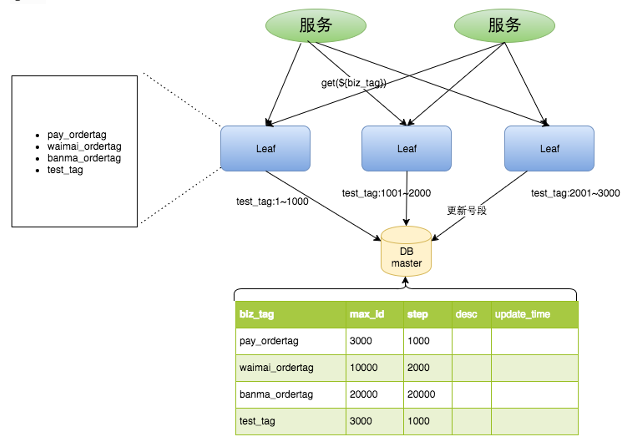
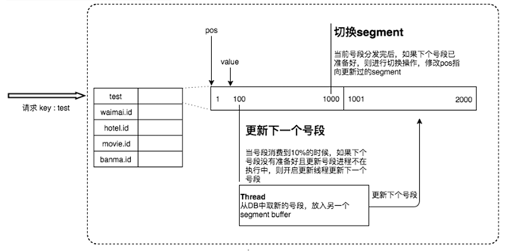
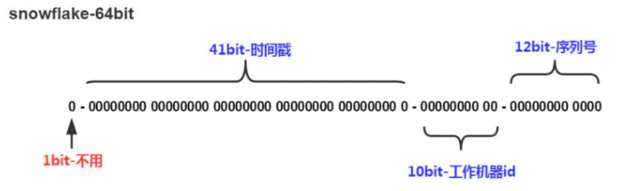
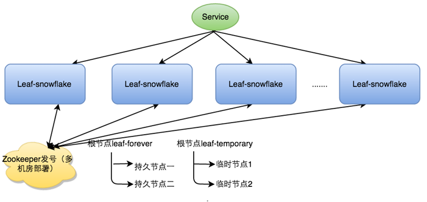
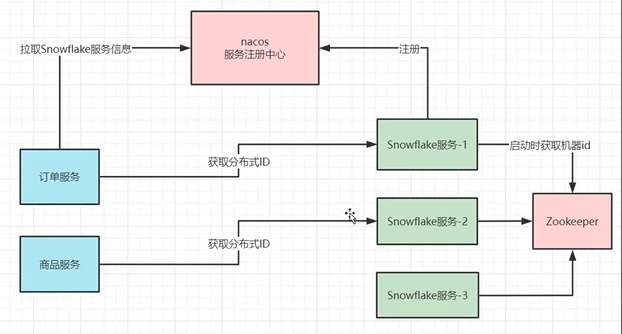

# Getting Started
在复杂分布式系统中，往往需要对大量的数据和消息进行唯一标识。如在美团点评的金融、支付、餐饮、酒店、猫眼电影等产品的系统中，数据日渐增长，对数据分库分表后需要有一个唯一ID来标识一条数据或消息，数据库的自增ID显然不能满足需求；

那业务系统对ID号的要求有哪些呢？

1. 全局唯一性：不能出现重复的ID号，既然是唯一标识，这是最基本的要求。
2. 趋势递增：在MySQL InnoDB引擎中使用的是聚集索引，由于多数RDBMS使用B+tree的数据结构来存储索引数据，在主键的选择上面我们应该尽量使用有序的主键保证写入性能。
3. 单调递增：保证下一个ID一定大于上一个ID，例如事务版本号、IM增量消息、排序等特殊需求。
4. 信息安全：如果ID是连续的，恶意用户的扒取工作就非常容易做了，直接按照顺序下载指定URL即可；如果是订单号就更危险了，竞对可以直接知道我们一天的单量。所以在一些应用场景下，会需要ID无规则、不规则。

上述123对应三类不同的场景，3和4需求还是互斥的，无法使用同一个方案满足。

同时除了对ID号码自身的要求，业务还对ID号生成系统的可用性要求极高：

1. 平均延迟和TP999延迟都要尽可能低；
2. 可用性5个9；
3. 3.高QPS。

想象一下，如果ID生成系统瘫痪，整个美团点评支付、优惠券发券、骑手派单等关键动作都无法执行，这就会带来一场灾难

# UUID方案

UUID（Universally Unique Identifier，保证全球唯一识别码）在分布式系统中作为主键ID时确实有其独特的优势，但也有一定的局限性。因此，不推荐使用UUID作为分布式系统主键ID

* **索引效率低** ：UUID是随机生成的，这会导致数据库索引变得不连续。对于B+tree索引来说，为了维护索引树结构平衡，插入新的UUID会引发频繁的页分裂，从而降低写入性能。
* **存储空间大** ：一个标准的UUID由36个字符组成（包括4个连字符），如果采用二进制格式存储，则需要16字节。相比之下，自增整数类型的主键可能只需要4或8字节。MySQL官方有明确的建议主键要尽量越短越好！

> B+ 树非叶子节点上是不存储数据的，仅存储键值，而 B 树节点中不仅存储键值，也会存储数据。B+ 树之所以这么做是因为在数据库中页的大小是固定的，InnoDB 中页的默认大小是 16KB。如果不存储数据，那么就会存储更多的键值，相应得树就会更矮更胖，如此一来我们查找数据进行磁盘的 IO 次数又会再次减少，数据查询的效率也会更快。比如我们的 B+ 树一个节点可以存储 1000 个键值，那么 3 层 B+ 树可以存储 1000×1000×1000=10 亿个数据。所以一般我们查找 10 亿数据，只需要 2 次磁盘 IO。
>
> 因为 B+ 树索引的所有数据均存储在叶子节点，而且叶子之间是通过双向链表连接的。那么 B+ 树使得范围查找，排序查找，分组查找以及去重查找变得异常简单。而 B 树因为数据分散在各个节点，要实现这一点是很不容易的。

# 数据库生成

单独创建1个数据库1张表，简单随便创建两个字段，利用MySQL的自增主键，所有的分布式服务均接入该数据库来取号，因为单数据库是共享的天然具有分布式机制

但缺点是性能极低

# 美团Leaf-segment

Leaf这个名字是来自德国哲学家、数学家莱布尼茨的一句话：

> There are no two identical leaves in the world
>
> “世界上没有两片相同的树叶”

美团开源了Leaf-segment方案

| Field       | Type         | Null | Desc                                            |
| ----------- | ------------ | ---- | ----------------------------------------------- |
| biz_tag     | varchar(128) | NO   | biz_tag用来区分业务                             |
| max_id      | bigint(20)   | NO   | max_id表示该biz_tag目前所被分配的ID号段的最大值 |
| step        | int(11)      | NO   | step表示每次分配的号段长度                      |
| desc        | varchar(256) | YES  |                                                 |
| update_time | timestamp    |      |                                                 |

原来获取ID每次都需要写数据库，现在只需要把step设置得足够大，比如1000。那么只有当1000个号被消耗完了之后才会去重新读写一次数据库。读写数据库的频率从1减小到了1/step，更新号段的SQL语句如下：

```sql
 Begin
 UPDATE table SET max_id=max_id+step WHERE biz_tag=xxx
 SELECT tag, max_id, step FROM table WHERE biz_tag=xxx
 Commit
```

大致架构如下图所示



这种模式有以下优点：

- Leaf服务可以很方便的线性扩展，性能完全能够支撑大多数业务场景。
- ID号码是趋势递增的8byte的64位数字，满足上述数据库存储的主键要求。
- 容灾性高：Leaf服务内部有号段缓存，即使DB宕机，短时间内Leaf仍能正常对外提供服务。
- 可以自定义max_id的大小，非常方便业务从原有的ID方式上迁移过来。

这种模式有以下缺点：

- ID号码不够随机，能够泄露发号数量的信息，不太安全。
- TP999数据波动大，当号段使用完之后还是会hang在更新数据库的I/O上（数据库肯定加了锁的），tg999数据会出现偶尔的尖刺。
- DB宕机会造成整个系统不可用。

# 美团双缓存Leaf-segment

对于Leaf-segment的TP999问题描述如下：

Leaf 取号段的时机是在号段消耗完的时候进行的，也就意味着号段临界点的ID下发时间取决于下一次从DB取回号段的时间，并且在这期间进来的请求也会因为DB号段没有取回来，导致线程阻塞。如果请求DB的网络和DB的性能稳定，这种情况对系统的影响是不大的，但是假如取DB的时候网络发生抖动，或者DB发生慢查询就会导致整个系统的响应时间变慢。

美团双缓存Leaf-segment做了下述优化：
我们希望DB取号段的过程能够做到无阻塞，不需要在DB取号段的时候阻塞请求线程，即当号段消费到某个点时就异步的把下一个号段加载到内存中。而不需要等到号段用尽的时候才去更新号段。这样做就可以很大程度上的降低系统的TP999指标。详细实现如下图所示：



每个biz-tag都有消费速度监控，通常推荐segment长度设置为服务高峰期发号QPS的600倍（10分钟），这样即使DB宕机，Leaf仍能持续发号10-20分钟不受影响。

# 雪花算法

Leaf-segment方案可以生成趋势递增的ID，同时ID号是可计算的，不适用于订单ID生成场景，比如竞对在两天中午12点分别下单，通过订单id号相减就能大致计算出公司一天的订单量，这个是不能忍受的。面对这一问题，国外Twitter开源了snowflake算法：

- 时间戳单位是毫秒
- 10位workerId可以用于集群节点，也可用与机房号+集群节点，也可用于业务号+集群节点
- 12位序列号，很显然每毫秒可以生成2^12 = 4096个id，每秒可以生成400万个id



对于workerID的分配，当服务集群数量较小的情况下，完全可以手动配置。Leaf服务规模较大，动手配置成本太高。所以使用Zookeeper持久顺序节点的特性自动对snowflake节点配置wokerID。Leaf snowflake是按照下面几个步骤启动的：

1. 启动Leaf-snowflake服务，连接Zookeeper，在leaf_forever父节点下检查自己是否已经注册过（是否有该顺序子节点）。
2. 如果有注册过直接取回自己的workerID（zk顺序节点生成的int类型ID号），启动服务。
3. 如果没有注册过，就在该父节点下面创建一个持久顺序节点，创建成功后取回顺序号当做自己的workerID号，启动服务。



雪花算法高可用部署架构，将雪花生成器作为单独的服务部署成集群



雪花算法优点：雪花算法生成的ID是趋势递增，不依赖数据库等第三方系统，生成ID的性能也是非常高的，而且可以根据自身业务特性分配bit位，非常灵活。
雪花算法缺点：雪花算法强依赖机器时钟，如果机器上时钟回拨，会导致发号重复。如果恰巧回退前生成过一些ID，而时间回退后，生成的ID就有可能重复

todo: 时钟回拨兜底方案